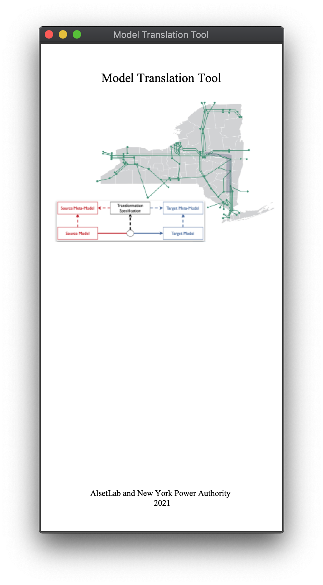
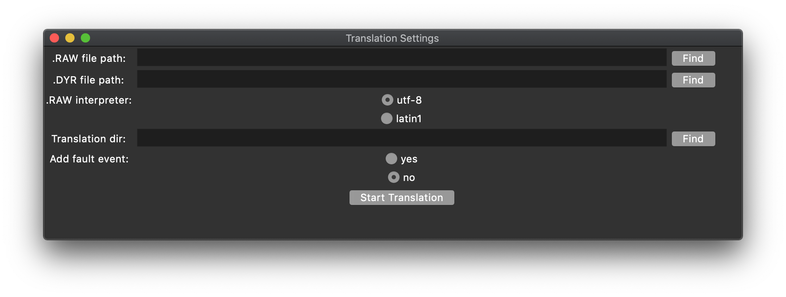
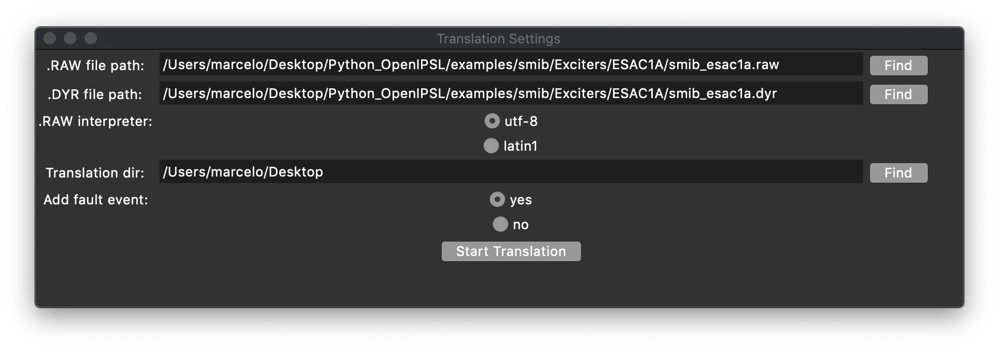
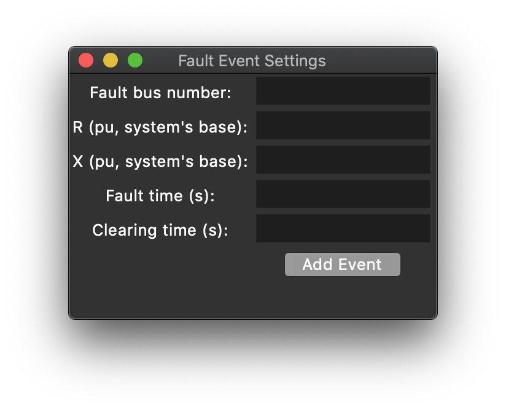
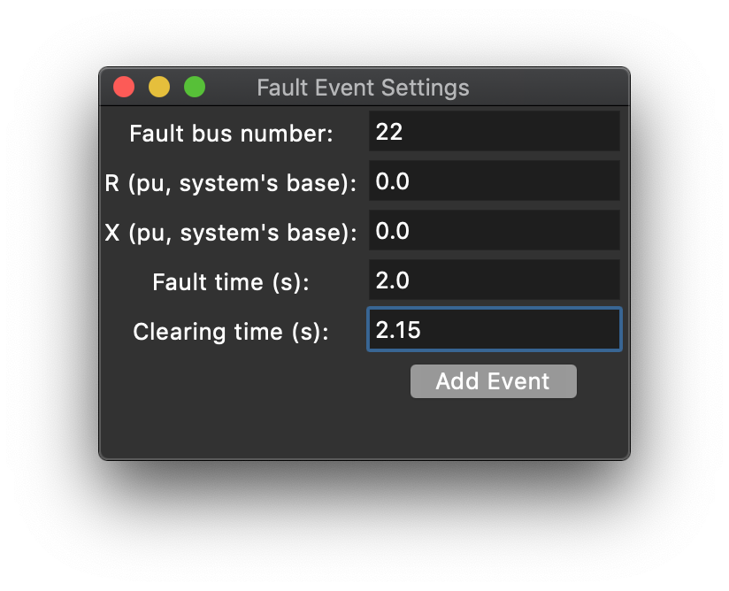
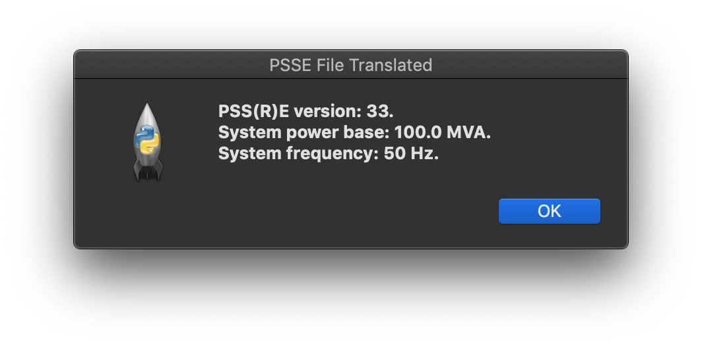

## Getting started

In order to work with the Tranlator Tool, the user needs to have a python 3 environment set up. Versions 3.7 and 3.9 were tested and the tool works fine on both. The tool was also tested in a Linux and in a Mac environment. The user should also install libraries such as:

- Pandas
- Numpy
- Tk 
- TLC

A more detailed guide can be found <a href="https://github.com/ALSETLab/NYPAModelTransformation/tree/master/ModelTransf-Tool">here</a>. The GUI can be started by using the following command in the tool's folder.

```
python3 main.py
```

The python command may vary depending on version and on operative system, but when the appropriate command is used, the user should see the following widget window.



## Translation Using GUI

To start a translation, the user should go to the main window and find: File > New Translation > From PSS/E File. A new widget window will pop up and it should look like the following.



The first field should be filled with the path pointing to the RAW file, while the second field should point to the DYR file. Note that the user can look for the path using the button located to the right from the text-dedicated input space. The user can select the type of decoder used in parsers, which allows the tool to read files with special characters. The user should also select the directory where the translation will be saved and, finally, the user can also opt for the inclusion of a Fault event in the model. An example of a properly filled window is shown below.



If the user selects that they want to include a Fault Event in the model, a new widget window will pop up. It will look like the following image. 



There, the user can specify an integer that will be the bus number to which the fault will be connected. The user can also specify the real numbers R and X which represents the Fault's resistance and reactance un per units, calculated using the system base. Finally, the user should also specify when the fault will start and when it will be cleared. This information is mapped into an instantiation of a Fault element available in the OpenIPSL. An example of a properly filled window is shown below. After filling the information, the user can press 'Add Event'.



If all the information is correctly loaded into the tool, the user can press 'Start Translation'. Some messages may appear in the command window from where the tool was launched and the user can check them in order to find inconsistencies in their original model or malfuctions in the translation procedure. A successful translation will result in a pop up window showing the some information of the system, such as PSSE version, system base power and system base frequency. The window is displayed below. 




## Translation Using Functions

## Simulation Results

## FMU and Real Time Simulation


<a href="./index">Go back</a> 